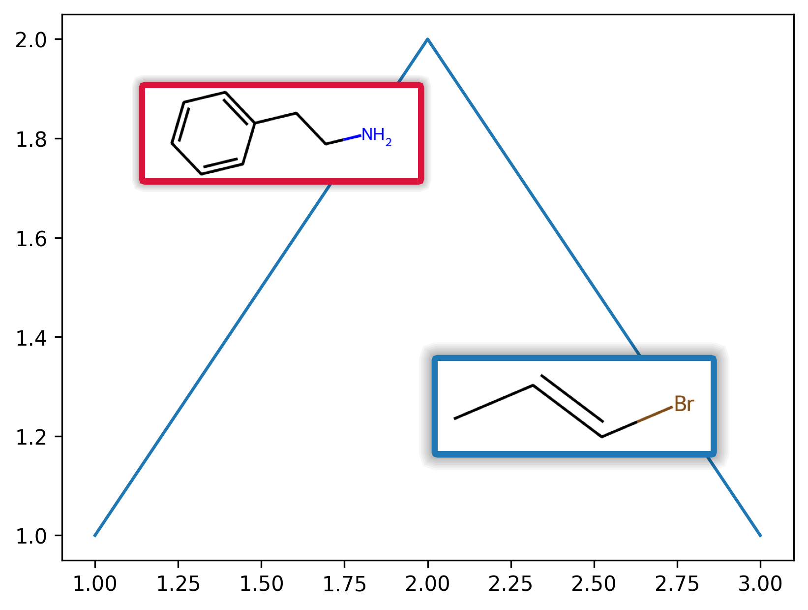
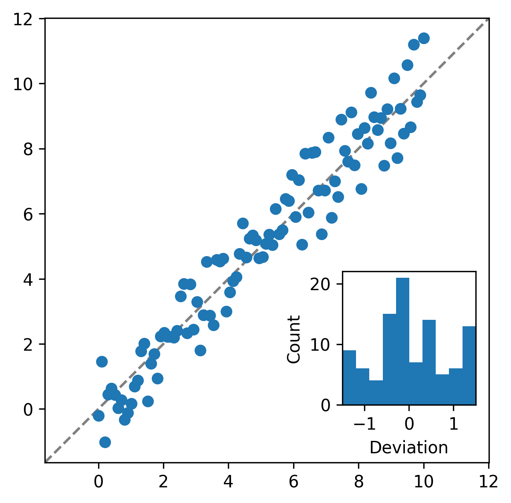

Tool Toad
==============

Adding Molecules to a Matplotlib Plot
--------------------------------------
Adding molecule drawings to a plot is easy with the functions ``drawMolInsert``, adding a frame with a shadow is done using ``addFrame``:

.. code-block:: python

    from tool_toad.visualization import addFrame, drawMolInsert

    fig, ax = plt.subplots()

    ax.plot([1, 2, 3], [1, 2, 1])

    insert1 = drawMolInsert(ax, Chem.MolFromSmiles('c1ccccc1CCN'), pos=(0.05,0.7))
    addFrame(insert1, ax, nShadows=17)

    insert2 = drawMolInsert(ax, Chem.MolFromSmiles('BrC=CC'), pos=(0.45,0.2))
    addFrame(insert2, ax, nShadows=20, edgecolor='tab:blue')

Plotting Correlations
--------------------------------------

.. code-block:: python

    from tool_toad.visualization import plot_parity, plot_residual_histogram

    N = 100
    x = np.linspace(0,10,N)
    y = x+3*(np.random.random(N)-0.5)

    fig, ax = plt.subplots()
    ax.scatter(x,y)

    plot_parity(ax, tick_base=2)

    ax_hist = plot_residual_histogram(ax, x, y, bins=10, xlabel='Deviation', loc=[0.67,0.13,0.3,0.3])

