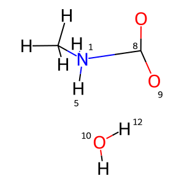
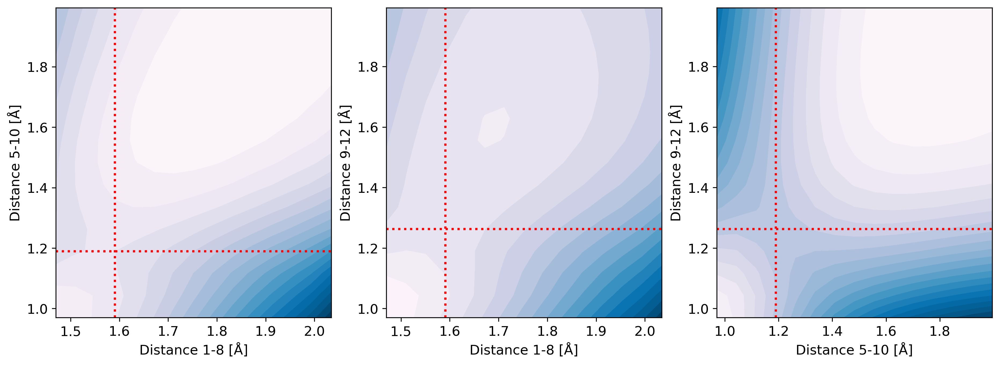

# Scanning a potential energy surface along multiple dimensions

Relaxed potential energy surface scans along multiple coordinates can be performed using the methods implemented in `ndscan.PotentialEnergySurface`.

Input molecule:

```python
from tooltoad.chemutils import xyz2ac

xyz = """13

C     -1.820137    0.791056    0.832598
N     -0.990792    0.327003   -0.268100
H     -1.645793    0.153047    1.697147
H     -2.888298    0.779865    0.596600
H     -1.523628    1.808782    1.086876
H     -1.131170   -0.663987   -0.463146
H     -1.182516    0.857131   -1.111779
O      0.990856    1.702911    0.540866
C      0.983091    0.616915    0.130413
O      1.438608   -0.409583   -0.190907
O     -0.415522   -2.481391   -0.868919
H     -0.287494   -3.370991   -0.534832
H      0.433595   -2.026999   -0.782961
"""

atoms, coords = xyz2ac(xyz)
```



## 1. Defining the internal coordinates to scan along

Define scan coordinates as list of dictionaries with the keys:
* list[int]: `atom_ids` (indexed from 0)
* float: `start`
* float: `end`
* int: `nsteps`

Alternatively, scan coordinates can be defined based on the current geometry of the structure:


```python
from ndscan import ScanCoord

scan_coords = [
    ScanCoord.from_current_position(atoms, coords, atom_ids=[1, 8], nsteps=15),
    ScanCoord.from_current_position(atoms, coords, atom_ids=[5, 10], nsteps=15),
    ScanCoord.from_current_position(atoms, coords, atom_ids=[9, 12], nsteps=15),
]
```

The first scan coordinate in the list is scanned by 1D xTB scans, all following coordinates are scanned via constraints.
It therefore is best to have the scan coordinate with the most steps as the first one to decrease overhead.

## 2. Perform the n-dimensional scan

A n-dimensional scan is performed via several 1D scans and the results are collected in n-dimensional tensors:
* `scan_tensor`: Storing the respective values of the coordinates
* `pes_tensor`: Storing the respective potential energy
* `traj_tensor`: Storing the respective coordinates

```python
from tooltoad.ndscan import PotentialEnergySurface

pes = PotentialEnergySurface(
    atoms=atoms, coords=coords, charge=0, multiplicity=1, scan_coords=scan_coords
)
```

Calling the `xtb` method on the `PotentialEnergySurface` will perform the necessary 1D scans at the xTB level of theory, [xTB arguments](https://xtb-docs.readthedocs.io/en/latest/commandline.html) can be parsed to `xtb_options`:

```python
pes.xtb(
    n_cores=-1,
    max_cycle=5,
    force_constant=1.0,
    xtb_options={"gfn2": None, "alpb": "water"},
)
```

Alternatively, the `orca` method can be called on the `PotentialEnergySurface` to perform the 1D scans with ORCA with the options specified as `orca_options`:
```python
pes.orca(
    n_cores=-1,
    max_cycle=5,
    orca_options={"r2scan-3c": None, "SMD": "water"},
)
```

## 3. Refining the potential energy surface

The scan can be refined with singlepoint calculations at a higher level of theory:

```python
pre.refine(
    n_cores=-1,
    orca_options={"wB97X-3c": None, "SMD": "water"},
)
```

## 4. Analyzing the potential energy surface

The results of the scan are stored as attributes in the `PotentialEnergySurface` object.
For a d-dimensional scan with m steps each and n atoms:
* `pes.scan_value_tensor` $(d_1, d_2,..., d_m, m)$: contains the values of each scan coordinate at each point
* `pes.pes_tensor` $(d_1, d_2,..., d_m)$: contains the electronic energy at each point along the scan
* `pes.traj_tensor` $(d_1, d_2,..., d_m, n, 3)$: containes the 3D cartesian coordintes for all n atoms at each point along the scan


Stationary points along the scan can be located using `find_stationary_points`:

```python
minima_points = pes.find_stationary_points(point_type="minima")
saddle_points = pes.find_stationary_points(point_type="saddle")
maxima_points = pes.find_stationary_points(point_type="maxima")
```

Where each is a list of dictionaries with the keys: `idx`, `energy` and `grad_norm`.

Slices through the potential energy surface can be visualized using `plot_point`:

```python
fig, ax = pes.plot_point(saddle_points[0]["idx"])
```


The coordinates of the saddle point can be obtained like this:

```python
ts_coords = pes.traj_tensor[saddle_points[0]["idx"]]
```
